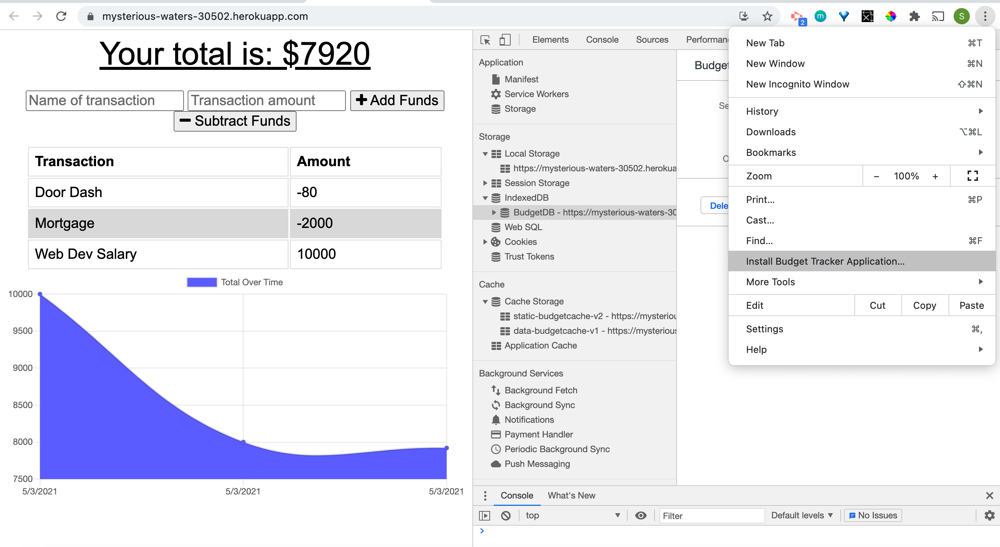
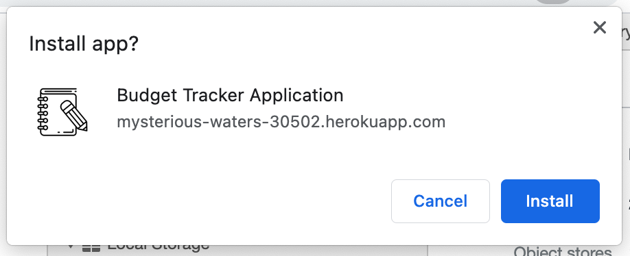
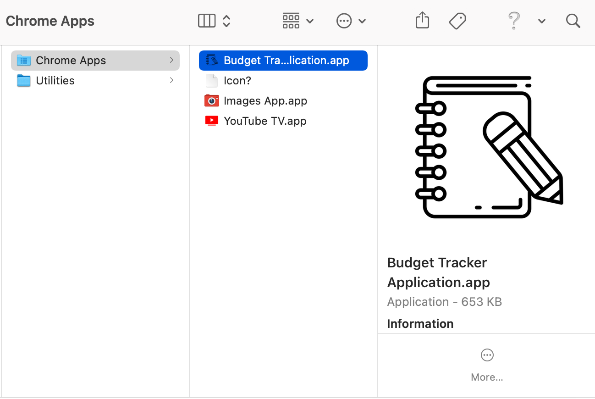
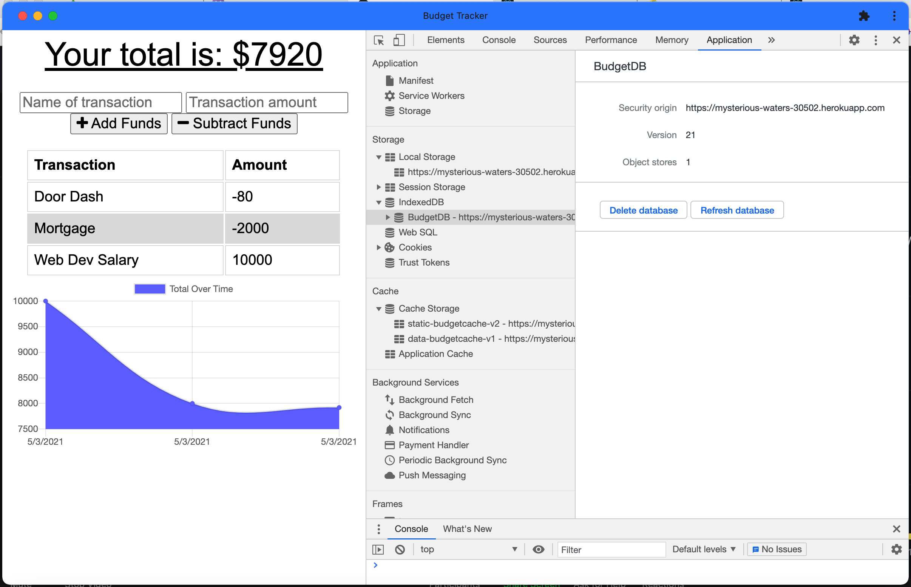
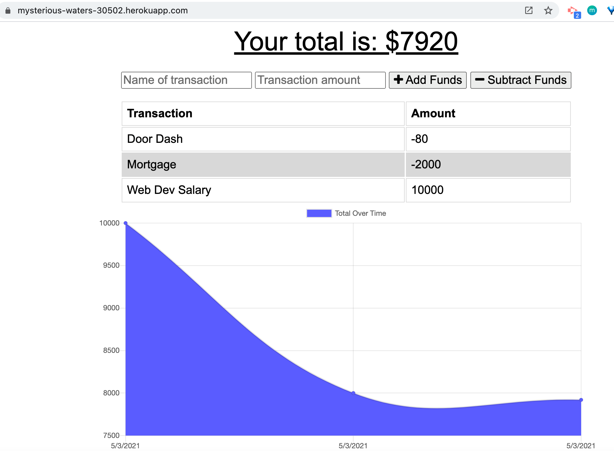
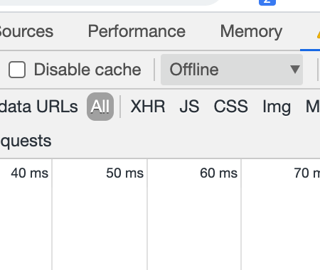
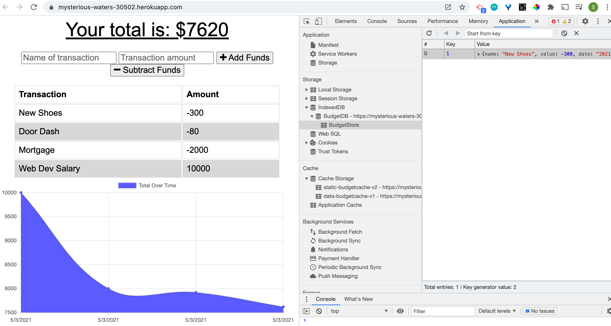
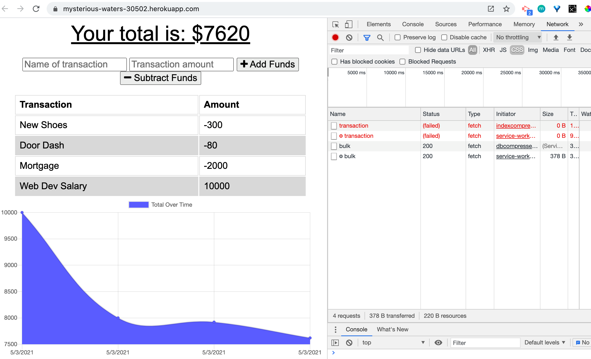

# Budget Tracker Progressive Web App
  [](https://opensource.org/licenses/MIT)

  ## Description

  This full stack progressive web application uses MongooseJS, MONGO DB, and Express to allow a user to keep track of their income and expenses even when they are travelling or otherwise offline. This web application can be installed as a desktop/mobile app, and works offline as well as online. Users can enter deposits and expenses offline, and when brought back online these offline expenses are automatically added to the budget tracker. Additionally, this web app uses minified client-side javascript and the npm compression module to enable it to load as quickly as possible. 


  ## Table of Contents

  * [Installation](#installation)
  * [Usage](#usage)
  * [Screenshots](#screenshots)
  * [License](#license)
  * [Contribute](#contribute)
  * [Tests](#tests)
  * [Questions](#questions)
 
  ## Installation

  This app is deployed live on heroku, and you can see it live at:

  [Live Deployed Application](https://infinite-anchorage-97440.herokuapp.com/)
  
  To install locally, do the following: 
  
  To install necessary dependencies, run the following command:

  ```
  npm i
  ```

  This app comes with a .env file which you should edit to reflect your personal/local database credentials and save. Then, to recreate the sample database on your local instance of mysql, run ./db/schema.sql which will create the necessary techblog_db in mysql for you. Finally, to seed the database with sample data, run:

  ```
  npm run seed
  ```

  To start the application, run:

  ```
  node server
  ```


  ## Usage

  This is a student repo.


  ## Screenshots

  
  
  
  
  
  
  
  


  ## License

  [](https://opensource.org/licenses/MIT) This project is licensed under the [MIT](https://opensource.org/licenses/MIT) license.


  ## Contribute

  Contributions are always welcome! (Please fork and pull request only.)


  ## Tests

  To run tests, run the following command: 

  ```
  npm test
  ```

  ## Questions

  If you have any questions about the repo, open an issue or contact me directly at susan.fujii@me.com. You can find more of my work at [srfujii](https://github.com/srfujii/).

